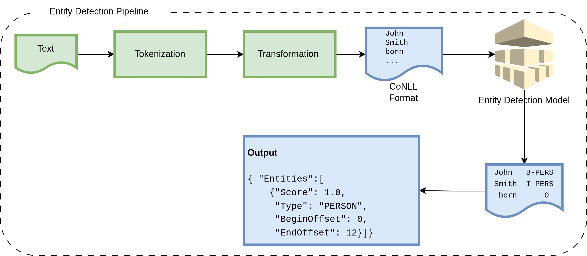

Customers own their data, and while a data use agreement permits the use of anonymized data, raw data cannot be used 
for model training. The anonymization tools are rule-based, shallow, English-only, and incapable of anonymizing text accurately 
resulting in high false negative rates. Effective anonymization requires both technical solutions and human intervention — an 
approach that was feasible at small scale but grows increasingly challenging as demand on annotators rises. This bottleneck 
directly limits ML applications, particularly data-hungry tasks such as pre-training LLMs and supervised fine-tuning, which 
require billions to trillions of tokens. The problem is further compounded by the diversity of data sources — surveys, interviews, 
product feedback, and conversational data — along with the risk of data and knowledge leakage between brands. 
To overcome these challenges, a named entity recognition model was trained on classify each word into one of  
37 possible classes. The model is trained on six languages.

