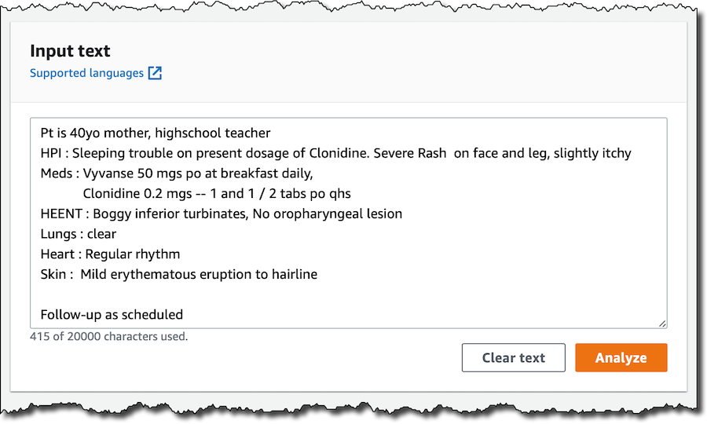
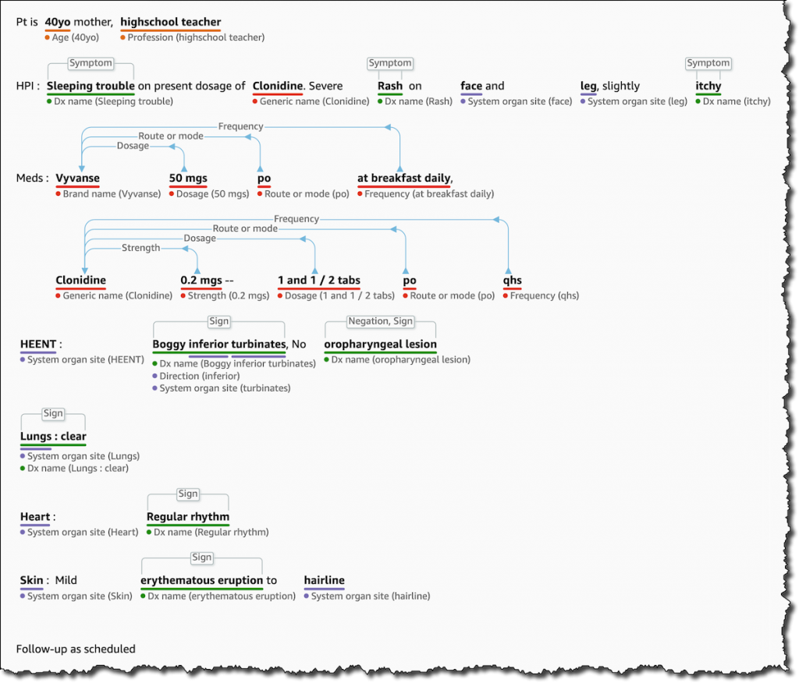

Amazon Comprehend Medical is a HIPAA-eligible natural language processing (NLP) service that uses machine learning that 
has been pre-trained to understand and extract health data from medical text, such as prescriptions, procedures, or diagnoses, medication brand and generic names, dosage, strength, duration, date/time and other traits such as negation.
The service also extracts private health information (PHI) including medical record numbers, patient names, age, address, location, race and ethnicity, etc.

#### Example

Input is clinical text that includes patient private information and clinical notes.

The output includes the entities, relationships between entities and attributes.

