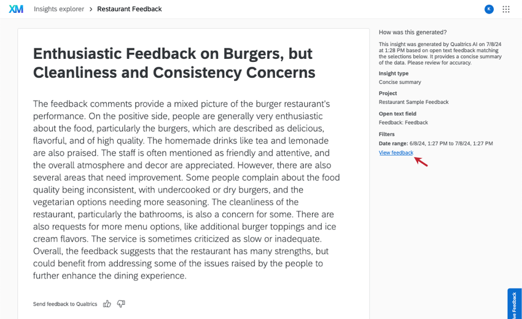

Insights Explorer is an AI-powered text analytics tool that uses your open-ended feedback to identify top themes, create headlines, and generate helpful summaries. This feature can help you understand large text datasets faster than ever, and is a great starting point for analysts working with unstructured feedback data.

Any type of project with open text fields can be used for generating insights. That includes:
- Survey projects
- Imported Data projects
- CX Dashboards
- Engagement
- Lifecycle
- Ad Hoc Employee Research
- Ticket Datasets 
- XM Discover projects

