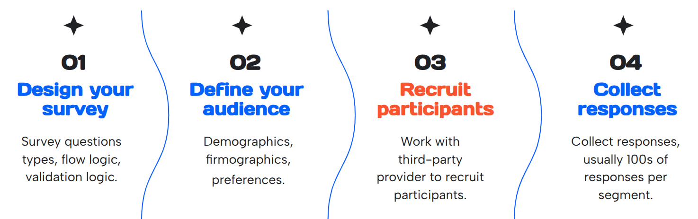
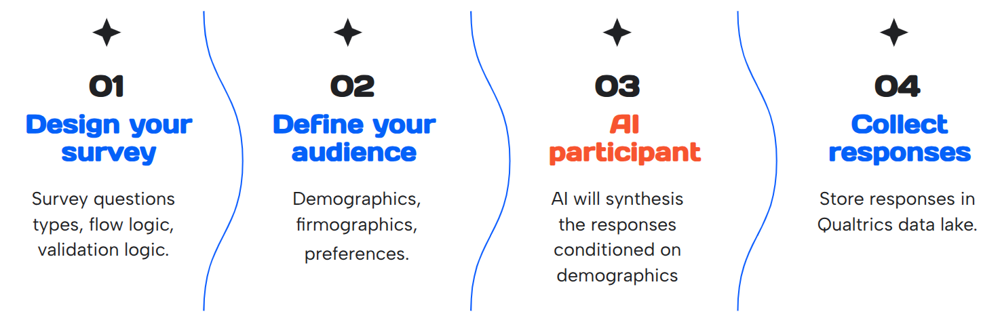

Normally, the online panels follow the steps outlines in the figure below. Recruiting the right participants for a study can be difficult. You may not get the exact demographics you need, and the shorter the deadline, the less sure you can be that everyone will answer on time. One possible solution can be to use synthetic panels.

Synthetic panels are powered by a first party proprietary AI model developed here at Qualtrics. Our synthetic panel is trained on thousands of responses from a variety of demographic backgrounds in order to more accurately predict how certain populations would respond to a survey.
- Trained on over 10 billions tokens.
- Completed training on 8 days.
- Utilized 32 A100 GPUs

The goal is to augment the human participants with the synthetic participants to fill in missing population segments and reduce recruitment time.

A short demo of the synthic panel can be found below. Note this is an edited version of the [original video](https://www.youtube.com/watch?v=nuk7BWID6dU&t=1049s).

