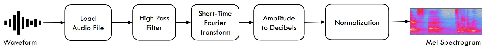

Voice style transfer, also known as voice cloning, create the same voice characteristics as of the original speaker while uttering different words in different languages.
To do that, a variational auto-encoder model was trained on two datasets:

##### Voice Conversion Toolkit (VCTK)
- 44 hours 
- 109 speakers

##### VoxCeleb1 and VoxCeleb2
- 2,000+ hours
- 7,000 speakers

The above data, which contains waveforms is converted to mel spectrograms using Short-Time Fourier Transform.

Then a variational auto-encoder called AutoVC, is trained on the data.

